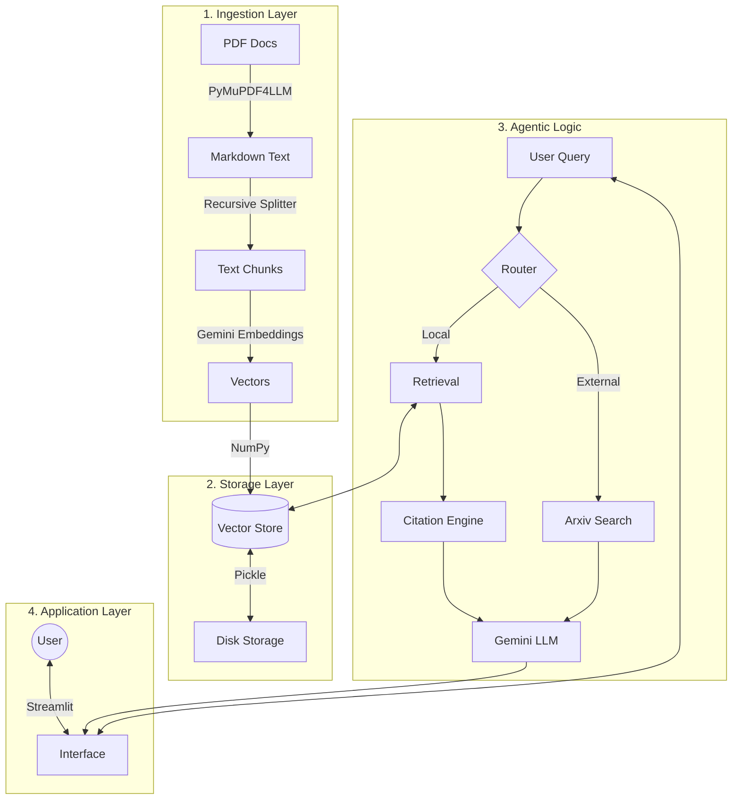

# Enterprise AI Agent Prototype

A lightweight, enterprise-ready AI agent for Document Q&A, built with Python, Streamlit, and Google Gemini.

## Features

### � Enterprise Performance
- **Custom Vector Engine**: Built on `NumPy` for lightning-fast cosine similarity (no heavyweight bloat).
- **Multi-Turn Memory**: understands context in follow-up questions (e.g., "Summarize this paper" -> "Who wrote **it**?").
- **Real-Time Latency Metrics**: Displays processing time for every interaction to ensure SLA compliance.
- **Precise Citations**: Cites not just the document name, but the **exact page number** where information was found to establish trust.

### 🧠 Core Capabilities
- **📄 Document Ingestion**: Handles multiple PDF documents with structure preservation (Tables, Headers).
- **🤖 Multi-modal LLM**: Powered by **Google Gemini 3 Flash** (or recent Gemini variants).
- **🔍 Arxiv Integration**: Agent autonomously switches tools to search for real-world research papers when asked.

## Setup Instructions

1. **Clone the Repository**
   ```bash
   git clone <repo-url>
   cd Stochastic
   ```

2. **Install Dependencies**
   ```bash
   pip install -r requirements.txt
   ```

3. **Set up Environment**
   - Create a `.env` file in the root directory.
   - Add your Google API Key:
     ```
     GOOGLE_API_KEY=your_api_key_here
     ```

4. **Run the Application**
   ```bash
   streamlit run app.py
   ```

## Usage

1. **Upload**: Use the sidebar to upload PDF documents. Click "Ingest Documents".
2. **Chat**: Ask questions about the documents.
   - Example directly from docs: *"What is the methodology?"* -> *"According to Paper X (Page 4)..."*
   - Example from Arxiv: *"Find papers about Agentic AI"* (The agent will switch tools automatically).

## Project Directory

```text
Stochastic/
├── app.py               # Main application entry point (Streamlit)
├── .env                 # Environment variables (API Keys)
├── requirements.txt     # Python dependencies
├── vector_store.pkl     # (Generated) Local vector database file
├── src/
│   ├── agent.py         # Main agent logic and tool routing
│   ├── ingest_data.py   # PDF parsing, chunking, and embedding logic
│   └── vector_store.py  # Custom NumPy-based vector store implementation
└── README.md            # Project documentation
```

## Architecture

The application checks follow a modular RAG (Retrieval-Augmented Generation) pipeline:



### 1. Ingestion Layer (`src/ingest_data.py`)
- **PDF Parsing**: Uses `PyMuPDF4LLM` to extract text while preserving structural elements like headers and tables, converting them to Markdown.
- **Chunking**: Implements a recursive text splitter that intelligently divides text by paragraphs and newlines to maintain semantic coherence.
- **Embedding**: Generates vector embeddings for each chunk using Google's `text-embedding-004` model.

### 2. Storage Layer (`src/vector_store.py`)
- **Vector Database**: A lightweight, persistent vector store built from scratch using `NumPy`.
- **Persistence**: Serializes vectors and metadata to disk (`vector_store.pkl`) using Python's `pickle` module for fast reloading between sessions.

### 3. Agentic Logic (`src/agent.py`)
- **Router**: Analyzes user queries to dynamically switch between **Local RAG** (for uploaded docs) and **Arxiv Search** (for external research).
- **Context Retrieval**: Performs cosine similarity search to find the top-k most relevant chunks.
- **Citation Engine**: Automatically appends source filenames and page numbers to the retrieved context for accurate citations.

### 4. Application Layer (`app.py`)
- **Frontend**: A Streamlit interface designed with enterprise-grade aesthetics (custom CSS).
- **Session Management**: Maintains chat history and agent state across multiple interaction turns.

